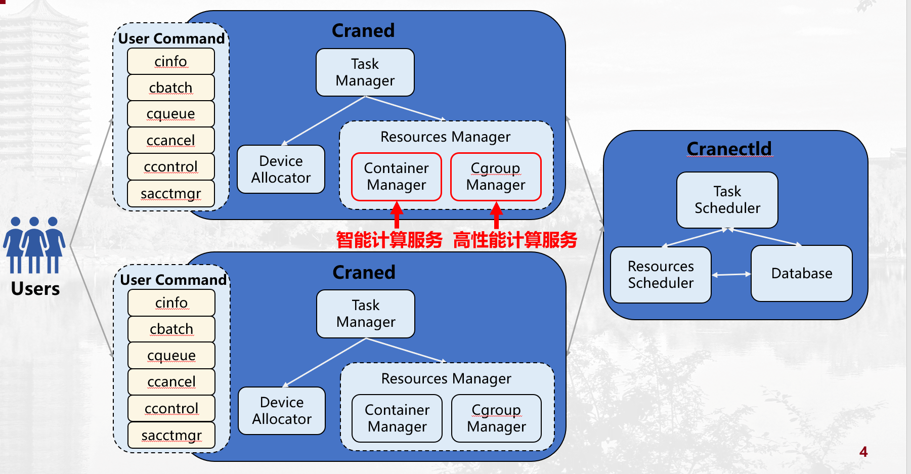
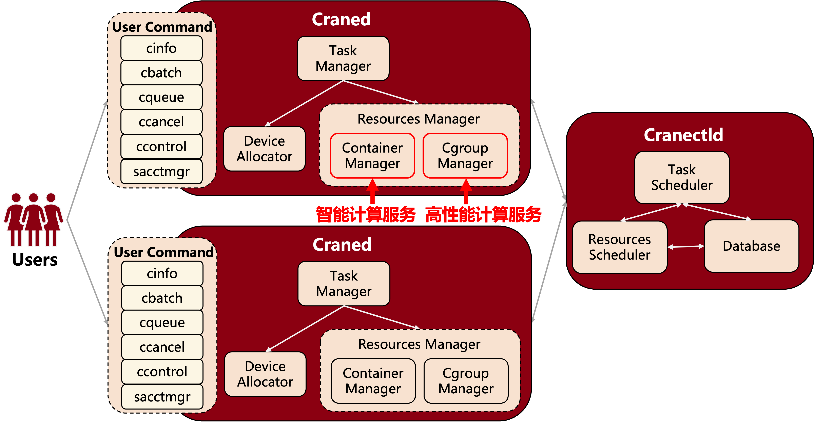

# CraneSched 简介 #

鹤思(CraneSched)是北京大学计算中心和北京大学长沙计算与数字经济研究院联合研发的算力中心智能调度系统。通过对高性能计算和智能计算两类作业场景进行细化建模与针对性优化，实现高性能计算与智能计算场景下的资源管理、作业管理、资源隔离、通讯加密等功能。

CraneSched分为前端和后端，前端主要是用Go开发，后端主要是用C++开发，欢迎开发者一起加入。

**CraneSched 在线试用地址** ：[CraneSched -Demo](https://hpc.pku.edu.cn/demo/cranesched )

**CraneSched前端开源地址**：[CraneSched -FrontEnd](https://github.com/PKUHPC/CraneSched-FrontEnd)

**CraneSched 后端开源地址**：[CraneSched](https://github.com/PKUHPC/CraneSched )

**CraneSched 文档地址**：[CraneSched-Document](https://pkuhpc.github.io/CraneSched-document )

# CraneSched  设计理念 #

- **完全开源**：源代码开放可得；
- **功能强大**：支持高性能计算与智能计算两种作业模式；
- **调度高效**：支持每秒调度10000个作业以上，支持同时运行300万个作业以上；
- **高度可伸缩**：支持100000个节点以上的算力中心规模；
- **安全可靠**：RBAC权限控制和通信加密；
- **代码精炼**：代码精炼高效，可读性高；
- **简洁易用**：用户使用指令和系统管理指令简洁易用；
- **高度可容错**：作业故障自动恢复、无单点故障、系统状态快速故障恢复。

# CraneSched  架构 #

针对算力中心的调度场景，CraneSched采用中心化管理模式，**Cranectld**是部署在主控节点的守护进程，也是调度系统的“大脑”。**Craned**是部署在计算节点上的守护进程，也是调度系统下达给计算节点的指令的执行者。

Cranectld负责算力中心节点生命周期的管理、作业队列的调度及管理、节点资源调度及管理，处理来自用户指令的作业提交、修改、查询等请求。Craned主要用来监控节点资源及作业状态，接受用户的各种指令，并将其发送给Cranectld，向用户传送Cranectld对指令处理的返回结果。

面向算力网络的国家战略，鹤思智能调度系统计划采用两级调度架构，上层调度为XCraneSched，下层调度为CraneSched，两者结合至上而下解决算力网络中算力资源调度问题。CraneSched针对单个算力中心资源调度，主要运行高性能计算和智能计算作业，通过适配器与XCraneSched连接，并承接来自XCraneSched分派的作业。XCraneSched通过各种适配器去连接超算、智算、云计算等各类算力中心，将其汇聚成一张算力网络，接受用户提交的作业，并将作业分发到最“合适”的算力中心。

