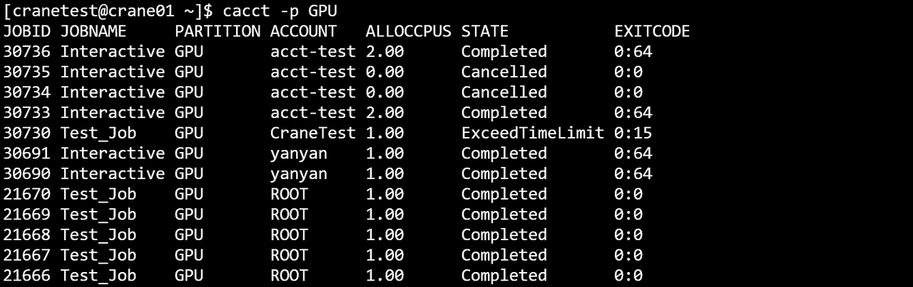
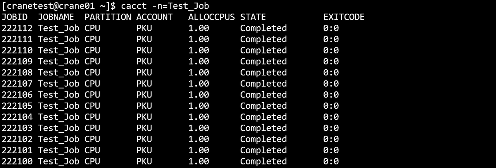
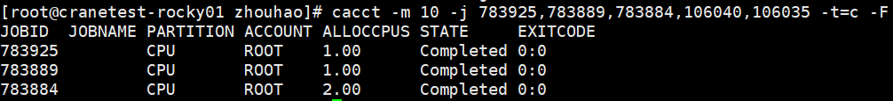
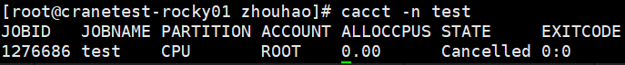
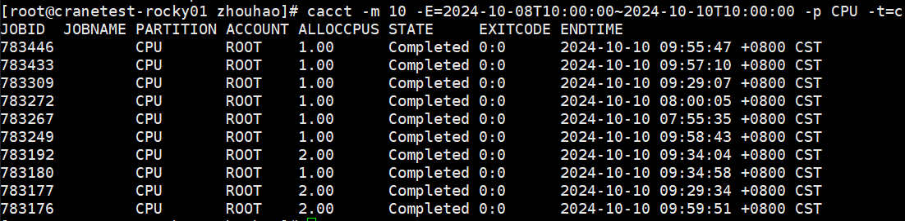

# cacct 查看作业信息 #

**cacct可以查看队列中的作业信息。**

查看集群中所有队列的作业信息（包括所有状态），默认输出100条信息。

```shell
cacct
```

**cacct运行结果展示**


### 主要输出项 ###

- **TaskId**：作业号
- **TaskName**：作业名
- **Partition**：作业所在分区
- **Account**：作业所属账户
- **AllocCPUs**：作业分配的CPU数量
- **State**：作业状态
- **ExitCode**：作业状态码

### 主要参数 ###

- **-A/--account string**：指定查询作业的所属账户，指定多个账户时用逗号隔开。
- **-C/--config string**：配置文件路径(默认为 "/etc/crane/config.yaml")
- **-E/--endtime string**：指定查询该时间之前结束的作业，例：cacct -E=2023-03-14T10:00:00
- **-o/--format string**：以指定格式输出结果表，可以指定输出指定列以及列宽。
- **-F/-full**：显示完整信息
- **-h/--help**：显示帮助
- **-j/--job string**：指定查询作业号，指定多个作业号时用逗号隔开。如 -j=2,3,4
- **--json**：json格式输出命令执行结果
- **-m/--max-lines uint32**：指定输出结果的最大条数。如-m=500表示最多输出500行查询结果
- **-n/--name string**：指定查询作业名，指定多个作业名时用逗号隔开
- **-N/--noheader**：输出隐藏表头
- **-p/--partition string**：指定要查看的分区，多个分区名用逗号隔开，默认为全部
- **-S/--startime string**：指定查询该时间之后开始的作业，例：cacct -S=2023-03-14T10:00:00
- **-t/--state string**：指定要查看的作业状态，支持的状态：挂起（p）、正在运行（r）、已完成（c）、失败（f）、已取消（x）、超过时间限制（t），全部。（默认为“全部”）
- **-s/--submit-time string**：筛选提交时间在特定时间段内的作业，可以使用封闭间隔或半开放间隔
- **-u/--user string**：指定查询某个用户的作业，指定多个用户时用逗号隔开。
- **-v/--version**：查询版本号
  - 例

  ~~~bash
  cacct
  ~~~
  
  
  ~~~bash
  cacct -h
  ~~~
  
  
  ~~~bash
  cacct -N
  ~~~
  
  
  ~~~bash
  cacct -S=2024-07-22T10:00:00~2024-07-24T10:00:00
  ~~~
  
  
  ~~~bash
  cacct -E=2024-07-22T10:00:00~2024-07-24T10:00:00
  ~~~
  
  
  ~~~bash
  cacct -j=30618,30619,30620
  ~~~
  
  
  ~~~bash
  cacct -u=cranetest
  ~~~
  
  
  ~~~bash
  cacct -A=CraneTest
  ~~~
  
  
  ~~~bash
  cacct -m=10
  ~~~
  
  
  ~~~bash
  cacct -p GPU
  ~~~
  

  ~~~bash
  cacct -n=Test_Job
  ~~~
  

  ~~~bash
  cacct -o="%j %.10n %P %a %t"
  ~~~
  

  ~~~bash
  cacct -A ROOT -m 10
  ~~~
  

  ~~~bash
  cacct -m 10 -j 783925,783889 -t=c -F
  ~~~
    

  ~~~bash
  cacct -n test
  ~~~
     

  ~~~bash
  cacct -q test_qos
  ~~~
   

  ~~~bash
  cacct -m 10 -E=2024-10-08T10:00:00~2024-10-10T110:00:00 -p CPU -t c
  ~~~
  