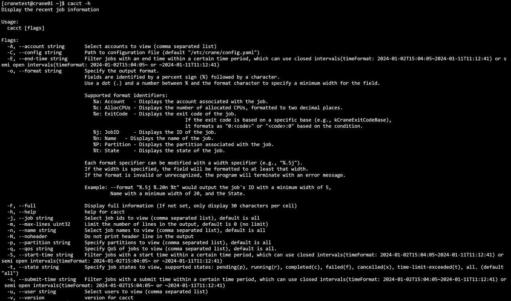

# cacct 查看作业信息 #
**cacct可以查看队列中的作业信息。**

查看集群中所有队列的作业信息（包括所有状态），默认输出100条信息。

```shell
cacct
```
**cacct运行结果展示**


### 主要输出项 ###
- **TaskId**：作业号
- **TaskName**: 作业名
- **Partition**：作业所在分区
- **Account**：作业所属账户
- **AllocCPUs**：作业分配的CPU数量
- **State**：作业状态
- **ExitCode**：作业状态码
### 主要参数 ###
- **--MaxVisibleLines/-m**：指定输出结果的最大条数。如-m=500表示最多输出500行查询结果
- **-A/--account string**：指定查询作业的所属账户，指定多个账户时用逗号隔开。
- **-C/--config string**：配置文件路径(默认为 "/etc/crane/config.yaml")
- **-E/--endtime string**：指定查询该时间之前结束的作业，例：cacct -E=2023-03-14T10:00:00
- **-o/--format string**：以指定格式输出结果表，可以指定输出指定列以及列宽。
- **--help/-h**: 显示帮助
- **-j/ --job string**：指定查询作业号，指定多个作业号时用逗号隔开。如 -j=2,3,4
- **-n/ --name string**：指定查询作业名，指定多个作业名时用逗号隔开。
- **--noHeader/-N**：输出隐藏表头
- **-S/--startime string**：指定查询该时间之后开始的作业，例：cacct -S=2023-03-14T10:00:00
- **-u/--user string**：指定查询作业的所属用户，指定多个用户时用逗号隔开。
  - 例
    ```shell
    cacct
    ```
    
    ```shell
    cacct -h
    ```
    
    ```shell
    cacct -N
    ```
    
    ```shell
    cacct -S=2023-03-14T10:00:00
    ```
    
    ```shell
    cacct -E=2023-05-07T10:00:00
    ```
    
    ```shell
    cacct -j=25,24,23
    ```
    
    ```shell
    cacct -u=root
    ```
    
    ```shell
    cacct -A=ROOT
    ```
    
    ```shell
    cacct -m=10
    ```
    
    ```shell
    cacct -o="TaskId,TaskName%30,Partition,Account,State"
    ```
    
