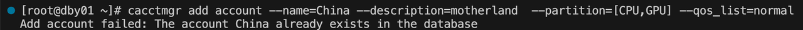
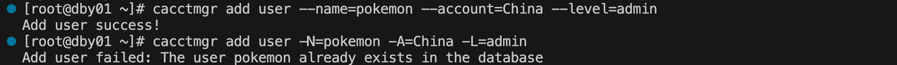

# cacctmgr 管理用户/账户信息 #

**cacctmgr 可以管理账户/用户信息，包括添加账户/用户、删除账户/用户、查找账户/用户。**

Crane作业调度系统中有三个用户角色：
- **系统管理员（Admin）**：可以增删查改任何账户和用户信息
- **账户管理员（Operator）**：可以修改部分该账户信息及账户下用户信息
- **普通用户(None)**： 仅可以查看部分信息，不可以修改所有用户和账户信息

## 1. 添加账户 ##

```bash
cacctmgr add account -name=China -describe=motherland  -partition=[CPU,GPU,UU] -Qos=normal
```

### 主要参数 ###
- **Qos**： 服务质量
- **describe**： 账户描述信息
- **name**： 账户名
- **parent**： 父账户
- **partition**： 可使用的分区名
  - 例
    ```shell
    cacctmgr add account -N=China -D=motherland  -p=CPU,GPU -q=normal
    ```
    
    ```shell
    cacctmgr add account --name=China --description=motherland  --partition=CPU,GPU --qos_list=normal
    ```
    

## 2. 添加用户 ##

系统管理员可以添加任意账户的用户，
账号管理员可以添加同一账号下的新用户。


```bash
cacctmgr add user --name=pokemon --account=China --level=admin
```

### 主要参数 ###
- **account**： 账户名
- **level**： 用户权限
  - **Admin**： 系统管理员
  - **Operator**： 账户管理员
  - **None**： 普通用户
- **name**： 用户名
- **partition**： 可使用的分区名
  - 例
    ```shell
    useradd pokemon
    cacctmgr add user --name=pokemon --account=China --level=admin
    ```
    

## 3. 删除用户 ##

系统管理员可以删除任意账户下的用户，
账户管理员可以删除同一账户下的新用户。

```bash
cacctmgr delete user pokemon
#等同于cacctmgr remove user pokemon
```


## 4. 删除账户 ##

仅系统管理员可以删除账户

```bash
cacctmgr delete account TEST
```


## 5. 查找用户 ##

所有用户均可以使用查询功能

```bash
cacctmgr find user pokemon
```


## 6. 查找账户 ##

```bash
cacctmgr cacctmgr find account China
```


## 7. 修改账户 ##

系统管理员可以修改任意信息，
账户管理员可以修改本身账户的信息，但不能更改账户的父账户。


```bash
cacctmgr modify account -name=China -describe=Splendid
```
### 主要参数 ###
- **Qos**： 服务质量
- **describe**： 账户描述信息
- **name**： 账户名
- **parent**： 父账户
- **partition**： 可使用的分区名
- **type**： 对账户运行的分区操作
  - **add**： 默认是添加操作
  - **delete**: 删除
  - **overwrite**： 覆盖


## 8. 修改用户##

系统管理员可以修改任意信息，
账户管理员可以修改同账户下用户的信息，但不能更改用户的账户。


```bash
cacctmgr modify user --name=pokemon -L=none
```

### 主要参数 ###
- **account**： 账户名
- **level**： 用户权限
  - **Admin**： 系统管理员
  - **Operator**： 账户管理员
  - **None**： 普通用户
- **name**： 用户名
- **partition**： 可使用的分区名


## 9. 显示账户树 ##


系统管理员会显示数据库所有根账户的账户树，
账户管理员和用户会显示本身账户的账户树。

```bash
cacctmgr show accounts
```


## 10. 显示用户 ##

系统管理员会显示所有用户，
账户管理员和用户会显示同一账户下的所有用户。

```bash
cacctmgr show users
```
