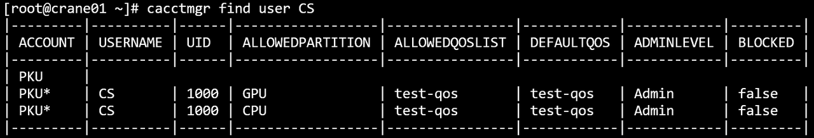
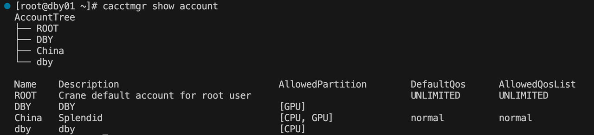
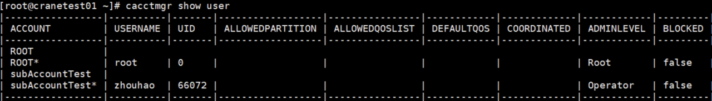

# cacctmgr 管理用户/账户信息 #

**cacctmgr 可以管理账户/用户信息，包括添加账户/用户、删除账户/用户、查找账户/用户。**

Crane作业调度系统中有三个用户角色：
- **系统管理员（Admin）**：一般为root用户，可以增删查改任何账户和用户信息
- **平台管理员（Operator）**：对账户系统具有完全权限，可以查看private data
- **账户调度员（Coordinator）**：对与自身同一账户下的用户以及对自身账户的子账户具有操作权限，包括添加用户
- **普通用户(None)**： 除了查询功能外不具备其他权限，能够查询与自身同一账户下的信息，不可以修改所有用户和账户信息

### 主要参数 ###
- **-h/--help**: 显示帮助
- **-C, --config string**： 配置文件路径（默认为"/etc/crane/config.yaml"）
### 主要命令 ###
- **help**：显示帮助
- **add**: 添加实体（实体包括QoS、账户、用户）
- **block**：禁用该实体，使其无法使用
- **delete**：删除实体
- **find**：找到特定实体
- **modify**：修改实体
- **show**：显示一类实体的所有记录
- **unblock**：解除禁用

## 1. 添加qos ##

### 主要参数 ###
- **-D, --description string**： qos描述信息
- **-h, --help**： 帮助
- **-c, --max_cpus_per_user uint32**： 默认为10
- **-J, --max_jobs_per_user uint32**
- **-T, --max_time_limit_per_task uint**： 以秒为单位的时间（默认3600）
- **-N, --name string**：qos的名称
- **-P, --priority uint32**：默认为1000
  - 例
    ```shell
    cacctmgr add qos -N=test -D="test qos"
    ```
    

## 2. 添加账户 ##

### 主要参数 ###
- **-Q, --default_qos string**： 账户默认qos
- **-D, --description string**：账号描述信息
- **-h, --help**： 帮助
- **-N, --name string**： 账户的名称
- **-P, --parent string**：此账户的父账户
- **-p, --partition strings**： 该账号可以访问的分区列表
- **-q, --qos_list strings**：账号可以访问的qos列表

  - 例：（添加账户PKU并添加PKU的子账户ComputingCentre）
    ```bash
    cacctmgr add account -N=PKU -D=school -p=CPU,GPU -q=test
    ```
    
    ```bash
    cacctmgr add account -N=ComputingCentre -D=department  -P=PKU
    ```
    


## 3. 添加用户 ##
系统管理员可以添加任意账户的用户， 账户管理员可以添加同一账号下的新用户。**添加的用户需要先有uid（先使用useradd在linux系统添加该用户）。**
### 主要参数 ###
- **-A, --account string**： 此用户所属的父账户
- **-c, --coordinate**：设置用户是否为父账号的账户调度员（coordinator）
- **-h, --help**： 帮助
- **-L, --level string**：设置用户权限(none/operator/admin) (默认为 "none")
- **-N, --name string**： 用户的名称
- **-p, --partition strings**： 该用户可以访问的分区列表
  - 例
    ```shell
    useradd CS
    ```
    ```shell
    cacctmgr add user -N=CS -A=PKU -p=CPU,GPU -L=admin
    # -p参数指明用户可用分区为CPU和GPU（分区必须同时为父账户PKU的可用分区），分区的allowed_qos_list与default_qos信息不支持指定，默认从父账户PKU中继承
    ```
    
    ```shell
    cacctmgr add user -N=lab -A=ComputingCentre
    # 未指明-p参数，partition与qos信息都从父账户ComputingCentre中继承
    ```
    

## 4. 删除用户 ##

系统管理员可以删除任意账户下的用户，
账户管理员可以删除同一账户下的新用户。

```bash
cacctmgr delete user lab
```


## 5. 删除账户 ##

仅系统管理员可以删除账户，删除账户时会检查账户下是否还有子账户或者用户，如果有则不允许删除，防止产生游离的用户，需要将其子账户和用户都设置在新账户下。

```bash
cacctmgr delete account ComputingCentre
```


## 6. 删除qos ##

```bash
cacctmgr delete qos test
```


## 7.  阻止用户或账户 ##
### 主要命令 ###
- **account**： 阻止账户
- **user**：阻止账户下的用户
```bash
cacctmgr block user lab -A=ComputingCentre
```

```bash
cacctmgr block account ComputingCentre
```


## 8.  解除阻止用户或账户 ##
### 主要命令 ###
- **account**： 阻止账户
- **user**：阻止账户下的用户
```bash
cacctmgr unblock user lab -A=ComputingCentre
```

```bash
cacctmgr unblock account ComputingCentre
```


## 9. 查找用户 ##

所有用户均可以使用查询功能

```bash
cacctmgr find user lab
```

```bash
cacctmgr find user CS
```


## 10. 查找账户 ##

```bash
cacctmgr find account ComputingCentre
```

```bash
cacctmgr find account PKU
```


## 11. 查找qos ##

```bash
cacctmgr find qos test
```


## 12. 修改账户 ##

系统管理员可以修改任意信息，
账户管理员可以修改本身账户的信息，但不能更改账户的父账户。


```bash
cacctmgr modify account -name=China -describe=Splendid
```
### 主要参数 ###
- **--add_allowed_partition string**：将新项添加到允许的分区列表
- **--add_allowed_qos_list strings**：将新项添加到允许的qos列表
- **-Q, --default_qos string**： 修改账户默认qos
- **--delete_allowed_partition string**：从允许的分区列表中删除特定项目
- **--delete_allowed_qos_list strings**：从允许的qos列表中删除特定项目
- **-D, --description string**：修改账户的描述信息
- **-F, --force**： 强制操作
- **-h, --help**： 帮助
- **-N, --name string**：需要进行修改的账户名称
- **--set_allowed_partition strings**：设置允许的分区列表的内容
- **--set_allowed_qos_list strings**：设置允许的qos列表的内容
  - 例：
    ```shell
    cacctmgr modify account -N=ComputingCentre -D="Located in PKU" 
    ```
    

## 13. 修改用户##

系统管理员可以修改任意信息，
账户管理员可以修改同账户下用户的信息，但不能更改用户的账户。

### 主要参数 ###
- **-A, --account string**：设置用户使用的帐号
- **--add_allowed_partition strings**：将新项添加到允许的分区列表
- **--add_allowed_qos_list string**：将新项添加到允许的qos列表
- **-L, --admin_level string**：设置用户管理权限（none/operator/admin）
- **-Q, --default_qos string**： 修改账户默认qos
- **--delete_allowed_partition strings**：从允许的分区列表中删除特定项目
- **--delete_allowed_qos_list string**：从允许的qos列表中删除特定项目
- **-F, --force**： 强制操作
- **-h, --help**： 帮助
- **-N, --name string**：需要进行修改的用户名称
- **-p, --partition string**：被修改的分区，如果不显式设置该参数，默认修改所有分区
- **--set_allowed_partition strings**：设置允许的分区列表的内容
- **--set_allowed_qos_list strings**：设置允许的qos列表的内容

  - 例：
    ```shell
    cacctmgr modify user -N=lab -A=ComputingCentre -L=operator --delete_allowed_partition GPU    
    ```
    

## 14. 修改qos##

系统管理员可以修改任意信息，
账户管理员可以修改同账户下用户的信息，但不能更改用户的账户。

### 主要参数 ###
- **-D, --description string**：修改qos的描述信息
- **-h, --help**： 帮助
- **-c, --max_cpus_per_user uint32**：(默认10)
- **-J, --max_jobs_per_user uint32**
- **-T, --max_time_limit_per_task uint**：以秒为单位的时间（默认 3600）
- **-N, --name string**： 需要进行修改的qos名称
- **-P, --priority uint32**：(默认1000)


## 15. 显示账户树 ##


系统管理员会显示数据库所有根账户的账户树，
账户管理员和用户会显示本身账户的账户树。

```bash
cacctmgr show accounts
```



## 16. 显示用户 ##

系统管理员会显示所有用户，
账户管理员和用户会显示同一账户下的所有用户。

```bash
cacctmgr show users
```
