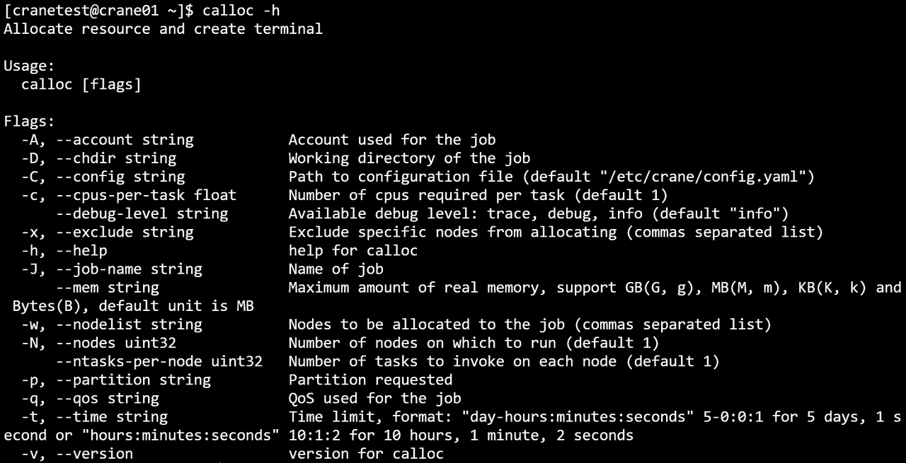

# calloc 提交交互式任务 #

**calloc 使用命令行指定的参数申请资源，任务启动时，会进入新的用户终端，用户需要自行登陆到计算节点并启动任务。calloc需要在有cfored运行的节点上启动。**

calloc 只支持通过命令行指定请求参数，支持的命令行选项：

- **--help/-h**：显示帮助
- **-A/--account string**：提交作业的账户
- **-D/--chdir string**：任务工作路径
- **-C/--config string**：配置文件路径(默认 "/etc/crane/config.yaml")
- **-c/--cpus-per-task float**：每个节点申请的CPU核心数
- **-J/--job-name string**：作业名
- **--mem string**：每个节点申请的内存大小
- **-N/--nodes uint32**：申请的节点数量
- **--ntasks-per-node uint32**：每个节点上运行的任务数量
- **-p/--partition string**：作业使用的分区/队列
- **-q/--qos string**：指定作业使用的qos名称-
- **-t/--time string**：作业的最长运行时间
- **-w/--nodelist string**：提交作业到指定节点运行
- **-x/--exclude string**：提交的作业排除某些指定节点运行
- **--export string**：设置环境变量
- **--get-user-env**：获取用户的环境变量
- **--gres**： 任务申请的设备资源量  
  - 格式为name:type:count如GPU:A100:2 或者name:count如GPU:2，由调度器决定分配给任务的设备type
- **-v/--version**: 查询版本号
- **--debug-level string**: 日志输出等级
- **--json**: json格式输出命令执行结果

~~~bash
calloc -h
~~~

退出calloc新启动的终端将结束任务。

在CPU分区，申请两个个节点，一个CPU核心，200M内存

~~~bash
calloc -c 1 --mem 200M -p CPU -N 2
~~~

运行结果：

- 例：在GPU分区下，申请一个节点，每个节点上运行两个任务，申请节点的候选列表为crane02,crane03，且任务提交在acct-yan账户下
~~~bash
calloc -A acct-test --ntasks-per-node 2 -w crane02,crane03 -p GPU -N 1
~~~

- 例：在CPU分区下，申请200M内存，任务运行最长时间为25分钟25秒，且任务运行在test-qos下
~~~bash
calloc --mem 200M -p CPU -q test-qos -t 00:25:25
~~~

~~~bash
calloc -D /path
~~~

~~~bash
calloc --debug-level trace
~~~

~~~bash
calloc -x cranetest02
~~~

~~~bash
calloc --get-user-env
~~~

~~~bash
calloc -J job_name
~~~
