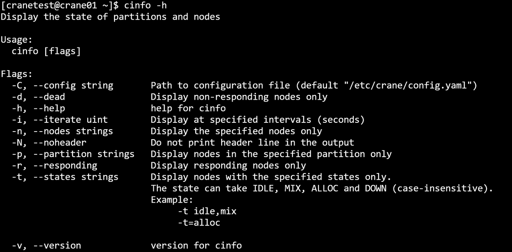

# cinfo 查看节点与分区状态 #

**cinfo可查询各分区节点的队列资源信息。**

查看分区节点状态：

~~~bash
cinfo
~~~

**cinfo运行结果展示**

#### 主要输出项 ####

- **PARTITION**：分区名
- **AVAIL**： 分区状态
  - **UP**： 可用
  - **DOWN**： 不可用
- **NODES**：节点数
- **STATE**：节点状态
  - **idel**： 空闲
  - **mix**： 节点部分核心可以使用
  - **alloc**： 节点已被占用
  - **down**： 节点不可用
- **NODELIST**： 节点列表

#### 主要参数 ####

- **-h/--help**：显示帮助
- **-C/--config string**：配置文件路径(默认为 "/etc/crane/config.yaml")
- **-d/--dead**：只显示无响应节点
- **-i/--iterate uint**：指定间隔秒数刷新查询结果。如 -i=3 表示每隔三秒输出一次查询结果
- **--json**：json格式输出命令执行结果
- **-n/--nodes string**：显示指定节点信息，多个节点用逗号隔开。例：cinfo -n crane01,crane02
- **-N/--noheader**:输出隐藏表头
- **-p/--partition string**：显示指定分区信息，多个分区用逗号隔开。例：cinfo -p CPU,GPU
- **-r/--responding**：只显示有响应节点
- **-t/--states string**：仅显示状态的信息。状态可以为(不区分大小写): IDLE, MIX, ALLOC和DOWN
- **-v/--verison**: 查阅版本号
  例
 ~~~bash
cinfo
~~~

~~~bash
cinfo -h
~~~

~~~bash
cinfo -N
~~~

~~~bash
cinfo -d
~~~

~~~bash
cinfo -i 3
~~~

~~~bash
cinfo -n crane01,crane02.crane03
~~~

~~~bash
cinfo -p GPU,CPU
~~~

~~~bash
cinfo -r
~~~

~~~bash
cinfo -t IDLE
~~~

~~~bash
cinfo -V
~~~

