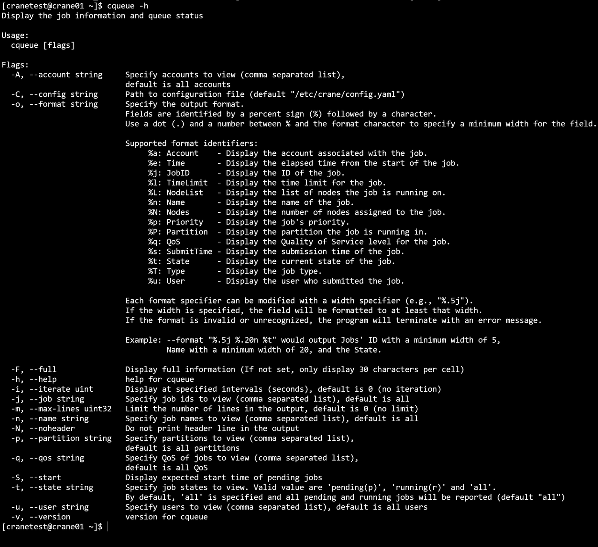
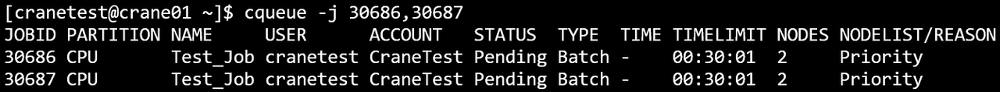
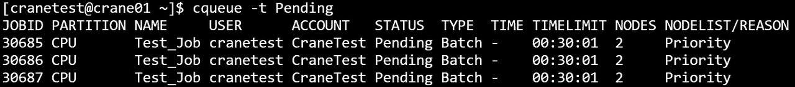
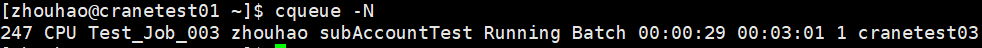
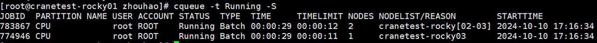

# cqueue 查看作业队列 #

**cqueue可以查看队列中的作业信息。**

查看集群中所有队列的作业信息（包括状态pending、running、cancelled），默认输出100条信息。

~~~bash
cqueue
~~~

**cqueue运行结果展示**


#### 主要输出项 ####

- **JobId**：作业号
- **Partition**：作业所在分区
- **Name**：作业名
- **User**：作业所属用户
- **Account**：作业所属账户
- **Status**：作业状态
- **Type**： 作业类型
- **TimeLimit**：作业时间限制
- **Nodes**：作业所分配节点数
- **NodeList**：作业运行的节点名

#### 主要参数 ####

- **-A/--Account string**：指定查询作业所属账户，指定多个账户时用逗号隔开
- **-C/--config string**：配置文件路径
- **-o/--format string**: 以指定格式输出结果表，可以指定输出指定列以及列宽
- **-F/--full**: 显示完整的内容，如果未指定，默认每项输出30个字符
- **-h/--help**: 显示帮助
- **-i/--iterate uint**：指定间隔秒数刷新查询结果。如 -i=3表示每隔三秒输出一次查询结果
- **-j/--job string**: 指定查询作业号，指定多个作业号时用逗号隔开。如 -j=2,3,4
- **--json**: json格式输出命令执行结果
- **-m/--MaxVisibleLines uint32**：指定输出结果的最大条数。如-m=500表示最多输出500行查询结果
- **-n/--name string**：指定查询作业名，指定多个作业名时用逗号隔开
- **-N/--noHeader**：输出隐藏表头
- **-p/--partition string**：指定查询作业所在分区，指定多个分区时用逗号隔开
- **-q/--qos string**：指定查询作业的QoS，指定多个QoS时用逗号隔开
- **--self**：查看当前用户提交的作业
- **-S/--start**：显示作业的开始时间（pending作业显示预期开始时间）
- **-t/--state string**：指定查询作业状态，指定多个状态时用逗号隔开
- **-u/--user**：指定查询作业所属用户，指定多个用户时用逗号隔开
- **/--version**：查询版本号
  - **例**
    ```shell
    cqueue -h
    ```
    
    ```shell
    cqueue -N
    ```
    
    ```shell
    cqueue -S
    ```
    
    ```shell
    cqueue -j 30674,30675
    ```
    
    ```shell
    cqueue -t Pending
    ```
    
    ```shell
    cqueue -t r
    ```
    
    ```shell
    cqueue -u cranetest
    ```
    
    ```shell
    cqueue -A CraneTest
    ```
    
    ```shell
    cqueue -i 3
    ```
    
    ```shell
    cqueue -p CPU
    ```
    
    ```shell
    cqueue -m 3
    ```
    
    ```shell
    cqueue -o="%n %u %.5j %.5t %.3T %.5T"
    ```
    
  - format中的指定列的对应缩写对照：
      - j-TaskId；n-Name；t-State；p-Partition；u-User；a-Account；T-Type；I-NodeIndex；l-TimeLimit；N-Nodes
    ```shell
    cqueue -n test
    ```
    
    ```shell
    cqueue -N
    ```
    
    ```shell
    cqueue -q test_qos
    ```
    
    ```shell
    cqueue --self
    ```
    
    ```shell
    cqueue -t Running -S 2024-01-02T15:04:05~2024-01-11T11:12:41
    ```
    