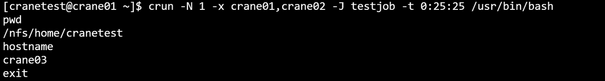
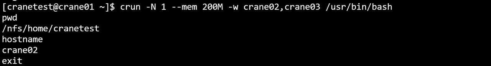
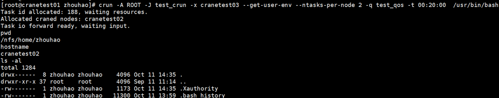

# crun 提交交互式任务 #

**crun使用命令行指定的参数申请资源并在计算节点启动指定的任务，用户的输入将被转发到计算节点上对应的任务，任务的输出将被转发回用户终端。crun需要在有cfored运行的节点上启动。**

crun只支持通过命令行指定请求参数，支持的命令行选项：

- **--help/-h**：显示帮助
- **-A/--account string**：提交作业的账户
- **-D/--chdir string**:任务工作路径
- **-C/--config string**：配置文件路径(默认 "/etc/crane/config.yaml")
- **-c/--cpus-per-task float**：每个节点申请的CPU核心数
- **-J/--job-name string**：作业名
- **--mem string**：每个节点申请的内存大小，不设置或者为0将使用调度器默认内存
- **-N/--nodes uint32**：申请的节点数量
- **--ntasks-per-node uint32**：每个节点上运行的任务数量
- **-p/--partition string**：作业使用的分区/队列
- **-q/--qos string**：指定作业使用的qos名称
- **-t/--time string**：作业的最长运行时间
- **-w/--nodelist**：提交作业到指定节点运行
- **-x/--exclude string**：提交的作业排除某些指定节点运行
- **--export string**：设置环境变量
- **--get-user-env**：获取用户的环境变量
- **--json**: json格式输出命令执行结果
- **-v/--version**: 查询版本号
- **--debug-level string**: 日志输出等级
- **--gres**： 任务申请的设备资源量  
  - 格式为name:type:count如GPU:A100:2 或者name:count如GPU:2，由调度器决定分配给任务的设备type

在一秒内两次ctrl+c发送sigint信号、使用ccancel取消任务、或者节点上的任务进程退出会结束任务。

在CPU分区，申请两个节点，一个CPU核心，200M内存，并运行bash程序：

~~~bash
crun -c 1 --mem 200M -p CPU -N 2 /usr/bin/bash
~~~

运行结果：

- 例：申请一个节点，且节点不能是crane01,crane02，任务名称为testjob，运行时间限制为0:25:25，并运行bash程序：

- 例：在GPU分区申请一个节点和200M运行内存，节点只能在crane02、crane03中选择，并运行bash程序：

crun还可以在calloc任务内嵌套启动，将自动继承calloc任务的所有资源。不需要指定除需要运行的程序外其他参数。

~~~bash
crun -A ROOT -J test_crun -x cranetest03 --get-user-env --ntasks-per-node 2 -q test_qos -t 00:20:00 /usr/bin/bash
~~~

~~~bash
crun -D --debug-level trace --export ALL /path /usr/bin/bash
~~~

~~~bash
crun -w cranetest04 /usr/bin/bash
~~~

